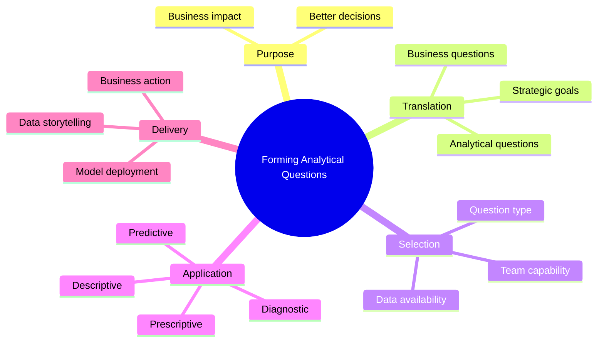

## Course 6: Forming Analytical Questions <a id="course-6"></a>

**Level:** Basic | **Instructor:** [Konstantinos Kattidis](https://www.datacamp.com/instructors/kkattidis) — Data Analytics Lead  
**Format:** 1 hour | 3 chapters | 35 course units (12 videos)  
**Part of track:** [Data Literacy Professional](https://app.datacamp.com/learn/skill-tracks/data-literacy-professional)

> 🔗 [Open the course on DataCamp](https://www.datacamp.com/courses/forming-analytical-questions)  
> 📖 [Course glossary](https://assets.datacamp.com/production/repositories/6194/datasets/1f1981108b95330fd98fb78e93de13d9dd017437/Forming%20Analytical%20Questions.pdf)

> **Working rule:** DataCamp tracks progress. This file preserves the course logic, Data's reasoning, useful mistakes, and practical transfer.

---

### What this course teaches

Business questions are usually too broad to guide analysis directly. This non-technical course explains how to clarify the underlying need, translate it into a well-formed analytical question, and choose an analytical approach that fits the question, available data, context, and team capabilities.

The result must then be translated back into business language so that evidence can support a real decision. That business ↔ technical bridge is the central theme of the course.

### 🧠 Course mental map



---

### Chapter 1: Delivering value through data

#### Chapter 1 — Lesson 1: Making a business impact *(Video)*

> 🎬 [Watch on DataCamp](https://campus.datacamp.com/courses/forming-analytical-questions/delivering-value-through-data?ex=1) *(requires login)*  
> 📜 Select **Transcript** inside DataCamp for the complete original transcript. The notes below are timestamped paraphrases.

**Transcript-derived notes**

- **00:00–00:45 — Why evidence matters:** Decisions based only on intuition or accepted theory can inherit bias and false assumptions. Analytics strengthens decisions, but only if the team focuses on the right problem.
- **00:45–01:16 — Value from Analytics:** The instructor introduces a six-step workflow that connects strategic goals to analytical work and business value.
- **01:16–02:08 — Business environment:** Strategic goals provide direction. Teams turn them into business questions such as understanding rising churn or increasing sales to existing customers.
- **02:08–02:47 — Translation bridge:** Business questions are often too broad for analysis. They must become analytical questions that support hypotheses and can be answered using data and analytical methods.
- **02:47–03:23 — Selecting a solution:** The analytical question comes before the technique. Selection also depends on data availability and team skills; examples include regression, time-series analysis, and forecasting.
- **03:23–03:48 — Returning to the business:** The analytics team develops and delivers the solution through data storytelling or model deployment, translating the result back into business language.
- **03:48–04:27 — Course focus:** The course concentrates on forming well-structured analytical questions and selecting solutions that address the original business problem.

**Quick recall**

```text
Strategic goal → Business question → Analytical question
→ Select solution → Develop solution → Deliver business value
```

**Data's angle**

Data first described business and technical people as asking differently phrased questions while seeking the same answer. The important refinement is that they do not necessarily produce the same intermediate answer: they work on the same underlying business problem and should remain aligned around the decision the evidence must support.

```text
Business:   Why are we losing customers?
Analytics:  Which segments changed, when, and with which measurable factors?
Business:   What should we test or change based on the evidence?
```

**DIKW and Data Storytelling connection**

Data and Information provide the evidence; Knowledge answers the analytical question; Wisdom uses that answer, with assumptions and trade-offs, to make a decision. Data Storytelling completes the return journey by communicating the finding in business language without distorting the evidence.

**Why this matters**

A technically correct method creates little value if it answers the wrong question. Begin with the business goal and decision—not with a preferred model.

**60-second active recall:** Close the file, reconstruct the six-step workflow, and answer: What must remain aligned when business and technical teams express the problem in different language?

---

#### Chapter 1 — Lesson 2: The "Value from analytics" workflow *(Exercise / 100 XP)*

> 📝 [Practice on DataCamp](https://campus.datacamp.com/courses/forming-analytical-questions/delivering-value-through-data?ex=2) *(requires login)*

**Original task**

You are preparing a proposal for the analytics team at CozySpace.com, an online marketplace for
short-term rentals. The example is a request from Maria in customer care.

> Place the steps in the right order.

**Verified solution**

| Order | DataCamp step | Why it belongs here |
|---:|---|---|
| 1 | Maria asks why customer complaints for short-term rentals have been increasing. | The workflow begins with the business problem, not with data or a preferred technique. |
| 2 | Clarify with Maria which customer demographics are complaining and for which time period. | The broad request needs scope, definitions, audience, and time boundaries before it becomes answerable. |
| 3 | Form the analytical question: “What factors are contributing to the increase in the customer complaint rate in Italy over the past two weeks?” | The business concern is translated into measurable population, location, period, outcome, and explanatory factors. |
| 4 | Choose diagnostic analysis and examine correlations between variables and the complaint rate. | The question asks **why** the rate increased, so diagnostic—not merely descriptive—analysis is appropriate. |
| 5 | Conduct the analysis using booking data and customer feedback. | Data and execution come after the question and method have been selected; otherwise the work can be technically correct but irrelevant. |
| 6 | Present the result: complaints rose because response time increased after an issue with the customer-service tool. | Value is created only when the analytical finding returns to the business as an understandable explanation that can support action. |

**Why the sequence matters**

Each step constrains the next one. Clarifying the business problem determines the analytical
question; the analytical question determines the method and required data; the analysis produces
evidence; and communication returns that evidence to the original business decision.

```text
Business request → Context and scope → Analytical question
→ Analytical approach → Evidence → Business meaning and action
```

**Business ↔ technical translation**

| Perspective | Expression of the same underlying problem |
|---|---|
| Business | Why are complaints increasing? |
| Analytical | Which measurable factors are associated with the higher complaint rate in Italy during the past two weeks? |
| Technical | Join booking and feedback data, define the complaint-rate measure, and use diagnostic analysis to examine relevant relationships. |
| Business return | Response time increased because of a customer-service-tool issue; investigate and fix that operational cause. |

**Important nuance and common trap**

- Do not start with the available dataset or a familiar model. First establish what decision the
  business needs to make and what analytical question can support it.
- Correlation helps identify relationships worth investigating, but correlation alone does not
  prove causation. A causal statement needs supporting evidence about mechanism, timing, and
  alternative explanations.

**Transfer principle**

When a new request arrives, do not ask “Which analysis can I run?” Ask:

```text
What business decision is blocked?
→ What must be clarified?
→ What measurable question would produce useful evidence?
→ Which method and data can answer that question?
→ How will the result return to the decision-maker?
```

---
